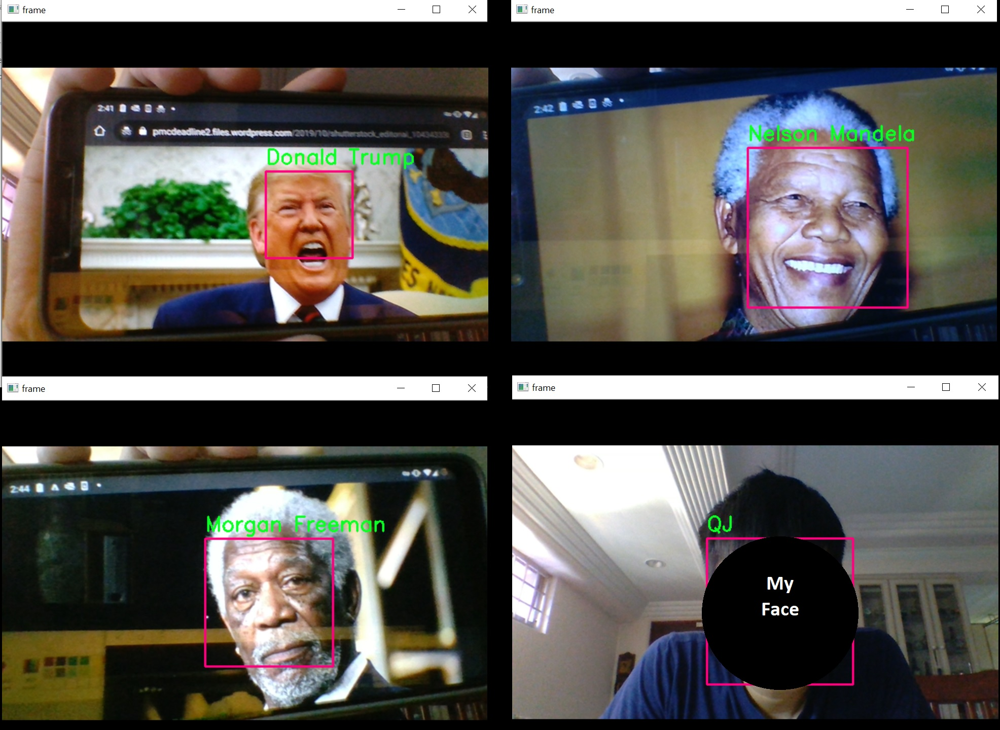

# Facial-Recognition-with-OpenCV-&-keras-vggface
Real-time face recognition project with OpenCV and keras-vggface.

## Setting up development environment
The requirements.txt file should list all Python libraries that this project depend on, and they will be installed using:
```
pip install -r requirements.txt
```

## Running the program
Unzip train_model/saved_model.zip before running the program. Run the program with:
```
python cv.py
```
## Model Explanation
train_model/saved_model.hdf was created with transfer learning using keras-vggface pretrained model. 
It was trained with images of 
1.  My face 
2.  Donald Trump 
3.  Nelson Mandela 
4.  Morgan Freeman 


## Training your own model
1.  Insert your own images in train_model directory
2.  Include the respective file paths in train_model/train.py. 
3.  Train the model with:
```
python train.py
```

# Results


